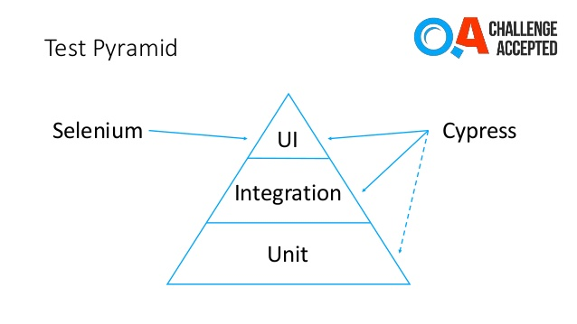

# QA Cypress testing project

QA automated testing project using Cypress.io

### How do I use this testing project?

- Fork your own copy of `mariabrum27/sample-cypress-project-2` to your account
  - Or clone this repo locally
- Navigate to the `sample-cypress-project-2` folder
- Run `nvm use` command
- Run `npm i` command
- Run `npm run cypress` command

# Overview

This is an overview of the QA Cypress project.

## Background

## Cypress

Cypress tests run inside of the browser! The only language Cypress supports is JavaScript.

### Key Differences

- [Architecture](https://docs.cypress.io/guides/overview/key-differences.html#Architecture)
  - Cypress executes in the same run loop as your application
  - Cypress controls the entire automation process from top to bottom
- [Native access](https://docs.cypress.io/guides/overview/key-differences.html#Native-access)
  - Cypress operates within your application
  - Test code can access all the same objects that your application code can
- [New kind of testing](https://docs.cypress.io/guides/overview/key-differences.html#New-kind-of-testing)
  - Cypress lets you alter any aspect of how your application works
  - You create the state required for a given situation like you would in an unit test
- [Shortcuts](https://docs.cypress.io/guides/overview/key-differences.html#Shortcuts)
  - You don't have to use the UI to build up state
  - You choose when to test like a user and when to skip slow and repetitive parts
- [Flake resistant](https://docs.cypress.io/guides/overview/key-differences.html#Flake-resistant)
  - Cypress is notified the moment the page loads and the moment the page unloads
  - Cypress executes its commands inside the browser; no network lag
  - You are insulated from manual waits or retries
  - Cypress automatically waits for elements to exist
- [Debuggability](https://docs.cypress.io/guides/overview/key-differences.html#Debuggability)
  - Cypress has custom error messages describing reason your test failed
  - Test runner UI shows command execution, assertions, network requests, spies, stubs, page loads, or URL changes
  - Cypress takes snapshots and enables you to "time travel" back
  - You can use the DevTools while your tests run
- [Trade offs](https://docs.cypress.io/guides/references/trade-offs.html)
  - Cypress is **not** a general purpose automation tool
  - Cypress commands run inside of a browser
  - No support for multiple browser tabs
  - Cannot drive two browsers at the same time
  - Each test is limited to only visiting a single superdomain (you can visit different subdomains in the same test)

### How Do I Cypress?

- Install Cypress as NPM package
  - Only successful using node v8.9.4 (npm v6.0.1)
- Write tests in JavaScript
- Debug in Cypress Test Runner
- Run tests from [command line](https://docs.cypress.io/guides/guides/command-line.html)
- Integrate in CI/CD pipeline(s)

### Why Would I Cypress?

[Introduction to Cypress](https://docs.cypress.io/guides/core-concepts/introduction-to-cypress.html)

- **Automatic Waiting:** Cypress is robust and "immune" to many common problems, such as:
  - The DOM has not loaded yet.
  - Your framework hasn’t finished bootstrapping.
  - An XHR request hasn’t responded.
  - An animation hasn’t completed.
- **Debuggability:** Readable errors, familiar tools, and stack traces.
- **Time Travel:** Hover over commands to see what happened.
- **Spies, Stubs, and Clocks:** Verify and control the behavior of functions, server responses, or timers.

#### Drawbacks

- Currently, only browsers in the Chrome family are supported.

### Further Reading

- [Key Differences](https://docs.cypress.io/guides/overview/key-differences.html)
- [Cypress.io and the future of web testing](https://automationpanda.com/tag/cypress/)
- [Cypress vs. Selenium](https://automationrhapsody.com/cypress-vs-selenium-end-era/)
- [Cypress tutorials](https://docs.cypress.io/examples/examples/tutorials.html)
